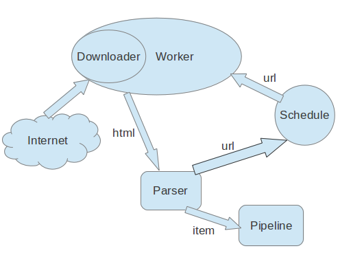

=========
架构介绍
=========

这篇文档描述了tigerspider的架构并且介绍了各个组件是如何工作的.

概述
======

下面这幅图描述了tigerspider的架构，组件，并且描述了在系统中数据流动的情况.对于各个组件的详细描述再图下面.

组件
=====

Scheduler
---------

Schedule主要负责url队列的管理。worker从Schedule中获得一个待抓的url。Schedule也负责接收Parser解析出来的新的Url。

Parser
-------

Parser主要是用户实现的，为了解析抓下来的网页的解析器。Parser主要生成两类信息，一类是新增的Url，另一类是提取出来的Item结果.一个爬虫可能有若干个解析器。解析器提取出来的数据都会被yield出去。

Pipeline
-------------

Pipeline主要是负责处理解析出来的Item.典型的处理包括：清洗数据，验证数据，持久划数据。

Item
--------

Item描述需要抓取的数据的信息，主要是用于描述需要提取的字段。

Worker
--------

worker是实际执行下载任务的组件，是比较底层的组件。启动一个worker，就是启动一个抓取任务，而抓取任务对应的规则就是Spider

Spider
---------

Spider是具体一个爬虫的描述.Spider包括若干个Parser，Pipeline
